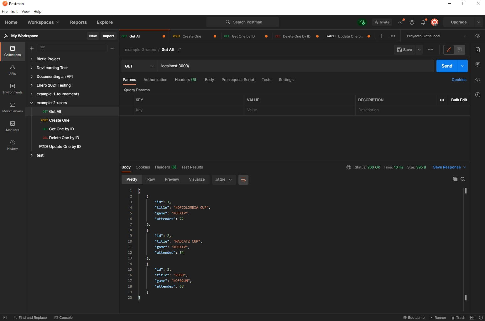

# CRUD - Requests test in Postman

_Code in order to practice Node.js basics, working on **CRUD** using two different examples (2 different fyles), using **local data**_

_Running on port 3000, requests by Postman_
***

## View

_There is a **Postman** preview for the diferent app functions._
* Postman request:<br>


***

## Technologies

A list of technologies used within the project:
* [Node.js](https://nodejs.org/es/) - JavaScript runtime
* [Express](https://expressjs.com/) - Framework for Node.js
*** 

## Installation

If you want clone this project. 
```
$ git clone https://github.com/Dan33311/crud-postman.git
$ cd ../path/to/the/file
$ npm install
$ npm start
```
Side information: Running local on port 3000, make requests by Postman.